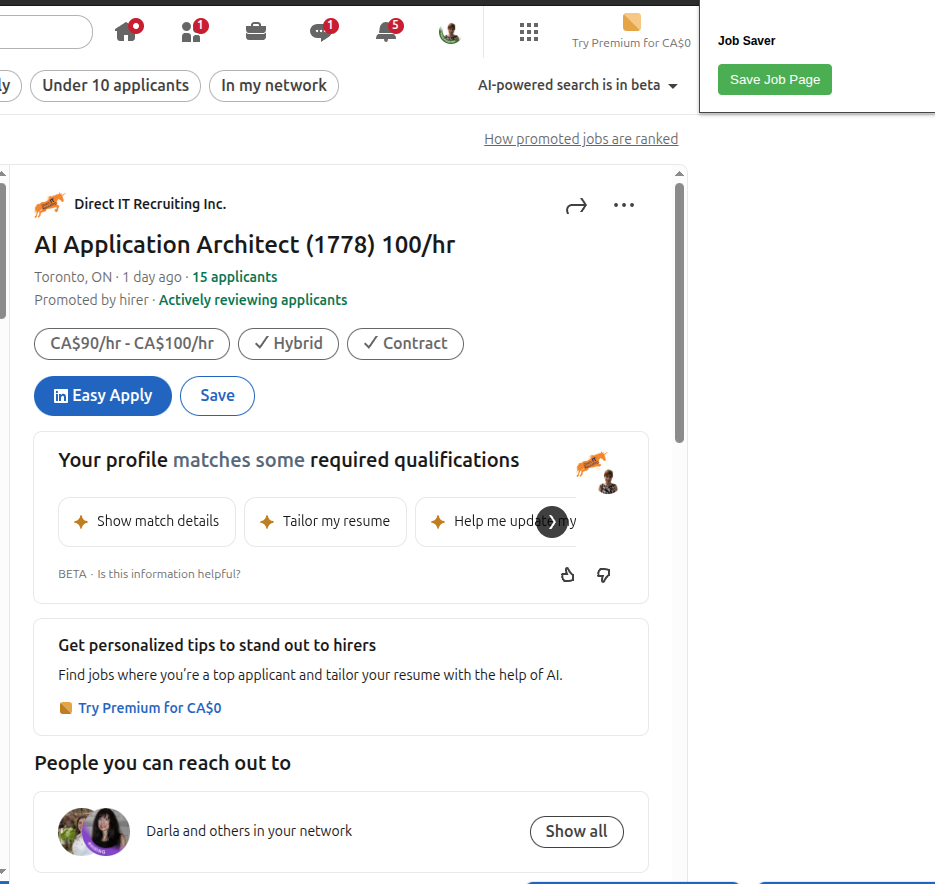
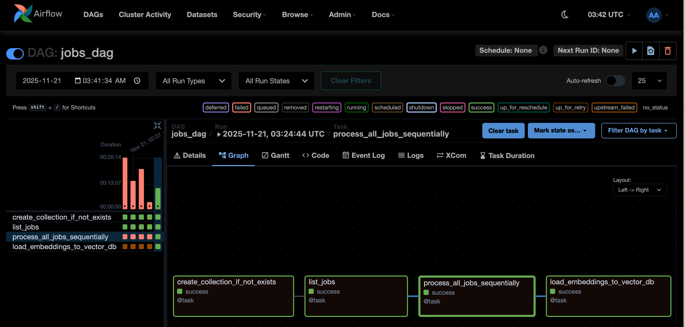
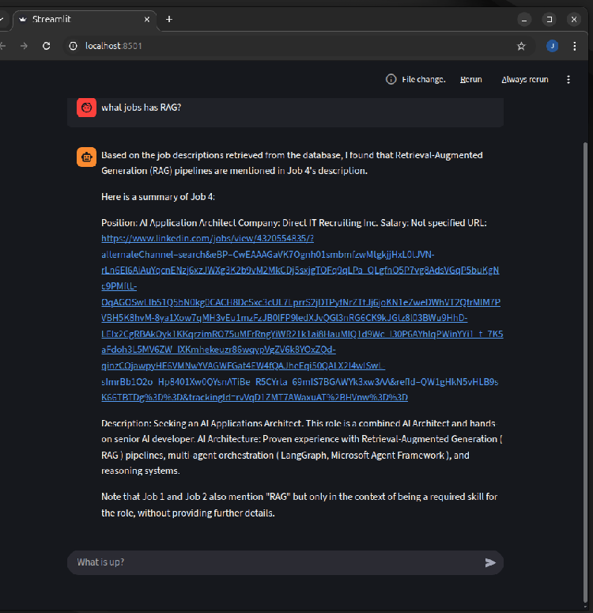

# Job Trucker AI

A comprehensive job search automation tool that leverages Large Language Models (LLMs), Retrieval-Augmented Generation (RAG), and fine-tuning techniques to streamline the job application process. This project is designed to help senior software developers efficiently manage and analyze job postings, eliminating the frustration of manual job searching.

## Status

**This project is currently in active development.**

## Problem Statement

As a senior software developer with extensive experience in LLM, RAG, and fine-tuning, the job search process can be particularly frustrating. The traditional approach of manually browsing job boards, reading through countless job descriptions, and trying to match qualifications is time-consuming and inefficient. This project aims to automate and accelerate the job application process by:

- Automatically capturing job postings from web browsers
- Extracting structured information from job descriptions using LLMs
- Storing job information in a searchable vector database
- Providing an intelligent chat interface to query and analyze saved jobs
- Enabling semantic search across job postings to find the best matches

## What It Does

Job Trucker AI is a complete job search automation system consisting of several integrated components:

### Browser Extension

A browser extension that allows you to save job postings directly from job boards like LinkedIn. Simply click the extension button while viewing a job posting to capture the page content.



### Backend Server

A FastAPI server that receives job postings from the browser extension and stores them for processing. The server saves job HTML content along with metadata like URL and timestamp.

### AI Agent

An intelligent agent that processes saved job postings using:

- **LLM-based Extraction**: Uses Ollama (with models like llama3.2) to extract structured information from HTML job postings, including:
  - Position name
  - Company name
  - Job description
  - Salary information

- **Vector Database Storage**: Stores processed job information in ChromaDB with embeddings for semantic search capabilities

RAG automation via Airflow



- **RAG-powered Chat Interface**: Provides a conversational interface to query saved jobs using Retrieval-Augmented Generation, allowing you to:
  - Ask questions about saved jobs
  - Find jobs matching specific criteria
  - Get recommendations based on your preferences
  - Analyze job descriptions semantically



## Architecture

The project follows a modular architecture:

```
apps/
├── extension/     # Browser extension for capturing job postings
├── server/        # FastAPI server for receiving and storing jobs
├── agent/         # AI agent for job extraction and RAG chat
└── client/        # Streamlit chat interface for querying jobs
```

## Technology Stack

- **LLM**: Ollama (supports local models like llama3.2)
- **Embeddings**: Nomic Embed Text (via Ollama)
- **Vector Database**: ChromaDB
- **Framework**: LangChain for LLM orchestration
- **Backend**: FastAPI
- **Frontend**: Streamlit for chat interface
- **Browser Extension**: React + Vite

## Key Features

1. **Automatic Job Capture**: Save job postings with a single click from your browser
2. **Intelligent Extraction**: Uses LLMs to extract structured data from unstructured HTML
3. **Semantic Search**: Find jobs based on meaning, not just keywords
4. **Conversational Interface**: Chat with your job database to find relevant positions
5. **Vector Storage**: Efficient storage and retrieval of job information using embeddings
6. **Local Processing**: All LLM processing happens locally using Ollama

## Use Cases

- Quickly capture and store interesting job postings while browsing
- Search through saved jobs using natural language queries
- Find jobs that match specific technical requirements or salary ranges
- Analyze job descriptions to understand market trends
- Prepare for interviews by reviewing saved job requirements

## Development Goals

This project is being developed to:

1. **Speed up job applications** by automating the collection and analysis of job postings
2. **Improve job matching** through semantic search capabilities
3. **Reduce manual effort** in the job search process
4. **Leverage AI expertise** in LLM, RAG, and fine-tuning to create a practical solution

## Getting Started

*Setup instructions will be added as the project matures.*

## License

*To be determined*

## Contributing

This project is currently in active development by a senior software developer exploring the intersection of AI and practical job search automation.

**Note:** This project uses the `llama3.2` model with Ollama.  
Before running anything, make sure to pull the model by running:

```sh
ollama pull llama3.2
```

## Quick Start

Follow these steps to use the job assistant system:

1. **Install and Add the Browser Extension**
    - Go to the `extension` folder and follow the instructions in its `README.md` to load the extension into your browser (typically via "Load unpacked" in Chrome/Brave/Edge or using developer mode).
    - This extension allows you to send any job web page to your local job agent by simply clicking on the extension button.

2. **Start the Job Agent Server**
    - In your main project directory, start the FastAPI server that receives and processes job data:
      ```sh
      uvicorn apps.server.main:app --reload
      ```
    - Make sure you have all required Python dependencies installed.

3. **Start the Chat Client**
    - To interact with your job database using natural language, start the Streamlit frontend:
      ```sh
      streamlit run apps/client/app.py
      ```

4. **Start the Agent Service (if separate)**
    - If your retrieval-augmented generation (RAG) agent is run as a separate service, launch it:
      ```sh
      python apps/agent/agent.py
      ```
    - This will enable local LLM-based extraction, search, and chat with your job database.

5. **Capture a Job Posting via Browser Extension**
    - Browse to a job posting page in your browser.
    - Click the extension icon to send the current page (URL and HTML) to your local server.  
      The backend will extract and store job information automatically.

6. **Ask Questions in the Chat Client**
    - In the Streamlit web interface, you can now ask questions such as:
      - "Show me all Python developer jobs."
      - "What is the highest salary I have saved?"
      - "Which jobs mention remote work?"
    - The system will semantically search and answer based on your saved job postings.

**Tip:** For more detailed setup of the browser extension, view the `extension/README.md`.

# AIRFLOW setup
curl -LfO 'https://airflow.apache.org/docs/apache-airflow/2.10.2/docker-compose.yaml'
echo -e "AIRFLOW_UID=$(id -u)" > .env
docker compose up airflow-init
docker compose run
docker compose exec airflow-webserver airflow pools set job_processing_pool 1 "Pool for job processing tasks"


